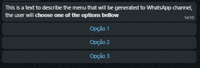
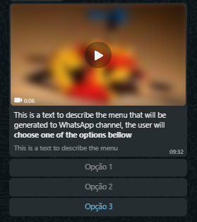
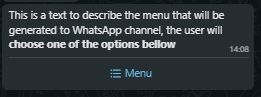
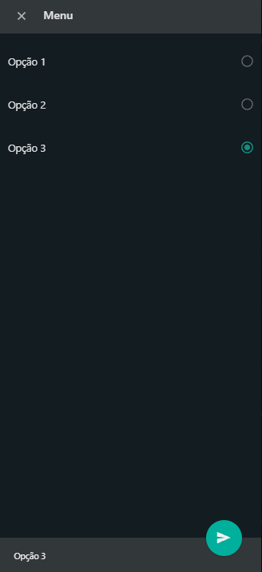
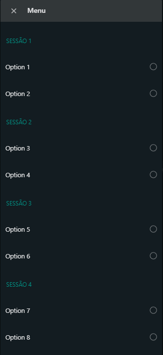

# createMenu

This script has some functions to create menus personality for each channel and with some formats configured by user.

## Text menu

Is a menu that is a text message formatted like a menu. This type of menu works in whathever channel and the user answers this message with a direct input by keyboard.


For break a line between options like in the image above, insert a '\n' character in the beginning of the text option.

Example:

```JSON
const menuFields = {
...
    'options': {
        'en-US': ['Option 1', 'Option 2', '\nOption 3'],
        'pt-BR': ['Opção 1', 'Opção 2', '\nOpção 3']
    },
...
}
```

## Quick Reply Menu

Is a menu that have iterative buttons that user can click and send a message without interact with keyboard. This type of menu works on Whatsapp, Blipchat, Facebook, Workchat and Telegram.



For the Whatsapp channel this menu supported media types like video, image and documents. To use media files in this menu, the header fields in props object shoud be a object media for Whatsapp. You can see more datails in this [link](https://developers.facebook.com/docs/whatsapp/guides/interactive-messages).

The examples below show how to configure the header field for send media files on whatsapp quick reply menu.

```JSON
# For image
"header": {
    "type": "image",
    "image": {
        "link": "http(s)://the-url"
    }
}

# For video
"header": {
    "type": "video",
    "video": {
        "link": "the-provider-name/protocol://the-url",
    }
}

# For document
"header": {
    "type": "document",
    "document": {
        "link": "the-provider-name/protocol://the-url",
        "filename": "some-file-name"
    }
}
```

The Quick Reply Menu in Whatsapp channel whith a video is showed in the image bellow.


## Whatsapp List menu

Is a menu that have a check box list. This menu have two states, opened and closed. When is closed the menu have just a text of body and the button to open it. When is open the menu show the options list in a check box and after the user select one option, a button to send the message apear in the end of menu.




You can separate menu options into sessions by sending an object in the options field.

Example:

```JSON
options: {
    'pt-BR': {
        "Selecione uma emoção": ['🙄 Deboche', '😵💫 Doida', '✅💃 Empoderada', '🤣 Engraçada', '😃 Felicidade', '🥸 Fofa'],
        "Veja mais títulos": ['Ver mais']
    }
},
```


