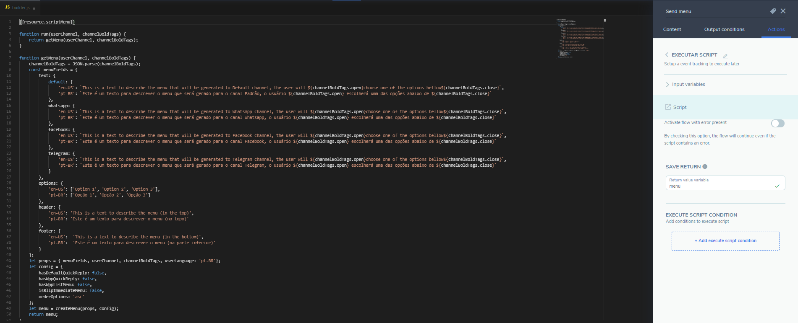
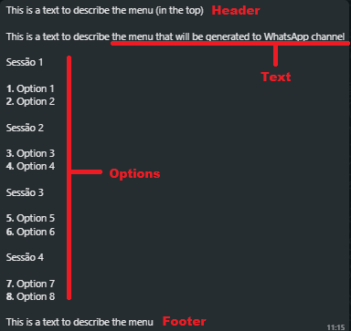

# createMenu

This script has some functions to create custom menus for each channel in a practical way and with support for several customizations.

This script has a main function called `createMenu` which receives the settings passed to the menu generation and returns a `menu` object with the `content` and `type` fields. These two fields must be used in the dynamic content block in the Builder, as illustrated in the image below.


To use it on the Blip platform, just copy and paste the script into a resource variable on the router bot as a text variable. For this example I stored the script in a variable called `scriptMenu`. Next, add a script as an input action in the block where you want to display the menu and call the `createMenu` function passing the `props` and `config` objects as parameters.



The props object must contain the properties of the menu to be generated. An object is expected with the fields `userChannel` (string with the name of the user's channel. It must be the same as some key of the menuFields.text field), `channelBoldTags` (Object with the opening and closing tags in bold in the platform informed ), `userLanguage` (language of the menu texts. It must be the same as some language informed in the fields of the menuFields object) and `menuFields` (Object with the fields of the menu to be generated).

Below is an example of the channelBoldTags object configured for the whatsapp channel.

```Javascript
const channelBoldTags = {
    open: '*',
    close: '*'
}
```

The `config` object is optional and defines the type of menu to be generated. By default, Quick Reply type menus are always generated when possible and text type menus when Quick Reply is not possible. When the generated menu is of the text type, the order of the numbers of the options is ascending.

Config object structure:

```Javascript
const config = {
    hasDefaultQuickReply = true,
    hasWppQuickReply = true,
    hasWppListMenu = false,
    isBlipImmediateMenu = true,
    orderOptions = 'asc'
}
```

The `orderOptions` field informs the order in which the options indexes will be generated in the text menu. The order can be ascending (asc) or descending (desc). The field `hasWppListMenu` informs that the check list type menu will be generated when the channel is Whatsapp. The `hasWppQuickReply` field informs that the quick reply menu will be generated when the channel is Whatsapp. The `hasDefaultQuickReply` field informs that whenever possible a quick reply menu will be generated. Finally, the `isBlipImmediateMenu` field sets the quick reply menu to disappear after the user selects an option.

## Text menu

Is a menu that is a text message formatted like a menu. This type of menu works in whathever channel and the user answers this message with a direct input by keyboard.


For this menu, there are some settings to customize it. It has four fields:

-   Header (optional): a text that appears at the top of the menu.
-   Text: a string describing the question / menu options.
-   Options: A list of options to be selected by the user.
-   Footer (Optional): A text that appears at the bottom of the menu, after the menu options.



To use this menu, create a structure like the one described in the example below and add this variable to the `props` object.

```Javascript
const menuFields = {
        text: {
            default: {
                'en-US': `This is a text to describe the menu that will be generated to Default channel, the user will ${channelBoldTags.open}choose one of the options bellow${channelBoldTags.close}`,
                'pt-BR': `Este é um texto para descrever o menu que será gerado para o canal Padrão, o usuário ${channelBoldTags.open} escolherá uma das opções abaixo de ${channelBoldTags.close}`
            },
            whatsapp: {
                'en-US': `This is a text to describe the menu that will be generated to WhatsApp channel, the user will ${channelBoldTags.open}choose one of the options bellow${channelBoldTags.close}`,
                'pt-BR': `Este é um texto para descrever o menu que será gerado para o canal Whatsapp, o usuário ${channelBoldTags.open} escolherá uma das opções abaixo de ${channelBoldTags.close}`
            },
            facebook: {
                'en-US': `This is a text to describe the menu that will be generated to Facebook channel, the user will ${channelBoldTags.open}choose one of the options bellow${channelBoldTags.close}`,
                'pt-BR': `Este é um texto para descrever o menu que será gerado para o canal Facebook, o usuário ${channelBoldTags.open} escolherá uma das opções abaixo de ${channelBoldTags.close}`
            },
            telegram: {
                'en-US': `This is a text to describe the menu that will be generated to Telegram channel, the user will ${channelBoldTags.open}choose one of the options bellow${channelBoldTags.close}`,
                'pt-BR': `Este é um texto para descrever o menu que será gerado para o canal Telegram, o usuário ${channelBoldTags.open} escolherá uma das opções abaixo de ${channelBoldTags.close}`
            }
        },
        options: {
            'en-US': ['Option 1', 'Option 2', 'Option 3'],
            'pt-BR': ['Opção 1', 'Opção 2', 'Opção 3']
        },
        header: {
            'en-US':
                'This is a text to describe the menu (in the top)',
            'pt-BR':
                'Este é um texto para descrever o menu (no topo)'
        },
        footer: {
            'en-US':
                'This is a text to describe the menu (in the bottom)',
            'pt-BR':
                'Este é um texto para descrever o menu (na parte inferior)'
        }
    };
```

The options field can be passed in two ways, as an array of strings or as a dictionary whose key is a string and the value is an array of strings. In the first case, the generated menu will only have a continuous list with the array options. In the second case the options will be separated by sessions whose session title is the key and the session options are the strings of that key's array of options. In both cases, you can place the special character `\n` at the beginning of the text of one of the options to skip a line, as noted in the first screenshot of this section.

Example for creating an option menu without sessions:

```Javascript
const menuFields = {
...
    options: {
        'pt-BR': ['Opção 1', 'Opção 2', '\nOpção 3']
    },
...
}
```

Example for creating an option menu with sessions:

```Javascript
const menuFields = {
...
    options: {
            'en-US': {
                "Section 1": ['Option 1', 'Option 2', 'Option 3', 'Option 4', 'Option 5'],
                "Section 2": ['Option 6', 'Option 7', 'Option 8']
            },
            'pt-BR': {
                "Sessão 1": ['Option 1', 'Option 2', 'Option 3', 'Option 4', 'Option 5'],
                "Sessão 2": ['Option 6', 'Option 7', 'Option 8']
            }
        },
...
}
```

## Quick Reply Menu

Is a menu that have iterative buttons that user can click and send a message without interact with keyboard. This type of menu works on Whatsapp, Blipchat, Facebook, Workchat and Telegram.


For the Whatsapp channel this menu supported media types like video, image and documents. To use media files in this menu, the header fields in props object shoud be a object media for Whatsapp. You can see more datails in this [link](https://developers.facebook.com/docs/whatsapp/guides/interactive-messages).

The examples below show how to configure the header field for send media files on whatsapp quick reply menu.

```Javascript
# For image
"header": {
    "type": "image",
    "image": {
        "link": "http(s)://the-url"
    }
}

# For video
"header": {
    "type": "video",
    "video": {
        "link": "the-provider-name/protocol://the-url",
    }
}

# For document
"header": {
    "type": "document",
    "document": {
        "link": "the-provider-name/protocol://the-url",
        "filename": "some-file-name"
    }
}
```

The Quick Reply Menu in Whatsapp channel whith a video is showed in the image bellow.


The menu fields are detailed in the image below.


## Whatsapp List menu

Is a menu that have a check box list. This menu have two states, opened and closed. When is closed the menu have just a text of body and the button to open it. When is open the menu show the options list in a check box and after the user select one option, a button to send the message apear in the end of menu.


The menu fields are detailed in the image below.


You can separate menu options into sessions by sending an object in the options field. As default, the menu have none sections.

Example:

```Javascript
options: {
    'pt-BR': {
                "Sessão 1": ['Option 1', 'Option 2'],
                "Sessão 2": ['Option 3', 'Option 4'],
                "Sessão 3": ['Option 5', 'Option 6'],
                "Sessão 4": ['Option 7', 'Option 8']
            }
},
```


