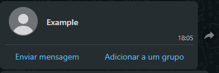
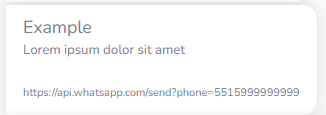
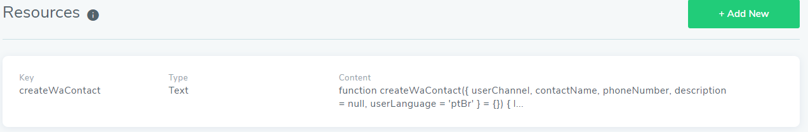

# createWaContact

Build an WhatsApp contact according user Channel.

<br><br>

**WhatsApp**




**Other Channels**



<br><br>

# How to Use

1. Add script, indicated below comment 'Resource', in the bot or router resource




2. import script into builder
Example

```js
{{resource.createWaContact}}
```

3. Call function createWaContact with props

```js
{{resource.createWaContact}}


function run(userChannel, userLanguage = 'ptBr') {
    return getWaContact(userChannel, userLanguage);
}

function getWaContact(userChannel, userLanguage = 'ptBr') {
    const contactName = 'Contact Name';
    const phoneNumber = '55123456789';
    const description = {
        ptBr: 'Maçã',
        enUs: 'Apple'
    };

    const props = {
        userChannel,
        contactName,
        phoneNumber,
        description,
        userLanguage
    };

    return createWaContact(props);
}
```

<br><br>

# Props
|accepted|
|---|
|userChannel|
|contactName|
|phoneNumber|
|description|
|userLanguage|
